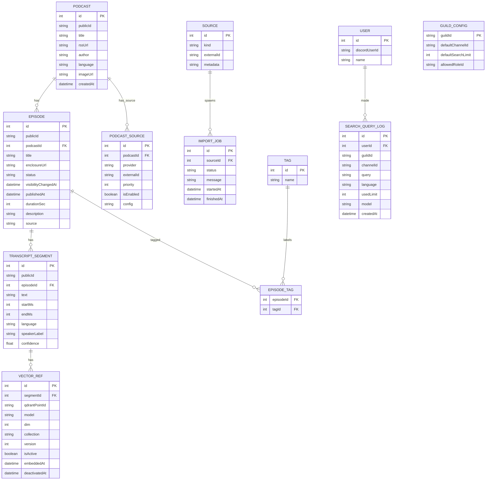

# データモデル（Mermaid）

```mermaid
erDiagram
  PODCAST {
    int id PK
    string publicId
    string title
    string rssUrl
    string author
    string language
    string imageUrl
    datetime createdAt
  }

  EPISODE {
    int id PK
    string publicId
    int podcastId FK
    string title
    string enclosureUrl
    string status
    datetime visibilityChangedAt
    datetime publishedAt
    int durationSec
    string description
    string source
    %% index: (podcastId, publishedAt)
  }

  TRANSCRIPT_SEGMENT {
    int id PK
    string publicId
    int episodeId FK
    string text
    int startMs
    int endMs
    string language
    string speakerLabel
    float confidence
    %% unique: (episodeId, startMs, endMs)
    %% index: (episodeId, startMs)
  }

  VECTOR_REF {
    int id PK
    int segmentId FK
    string qdrantPointId
    string model
    int dim
    string collection
    int version
    boolean isActive
    datetime embeddedAt
    datetime deactivatedAt
    %% unique: (segmentId, model, version)
  }

  PODCAST_SOURCE {
    int id PK
    int podcastId FK
    string provider
    string externalId
    int priority
    boolean isEnabled
    string config
    %% unique: (podcastId, provider)
    %% index: (podcastId, priority)
  }

  SOURCE {
    int id PK
    string kind
    string externalId
    string metadata
  }

  IMPORT_JOB {
    int id PK
    int sourceId FK
    string status
    string message
    datetime startedAt
    datetime finishedAt
  }

  TAG {
    int id PK
    string name
  }

  EPISODE_TAG {
    int episodeId FK
    int tagId FK
  }

  USER {
    int id PK
    string discordUserId
    string name
  }

  GUILD_CONFIG {
    string guildId PK
    string defaultChannelId
    int defaultSearchLimit
    string allowedRoleId
  }

  SEARCH_QUERY_LOG {
    int id PK
    int userId FK
    string guildId
    string channelId
    string query
    string language
    int usedLimit
    string model
    datetime createdAt
    %% index: (createdAt)
  }

  PODCAST ||--o{ EPISODE : has
  PODCAST ||--o{ PODCAST_SOURCE : has_source
  EPISODE ||--o{ TRANSCRIPT_SEGMENT : has
  TRANSCRIPT_SEGMENT ||--o{ VECTOR_REF : has
  SOURCE ||--o{ IMPORT_JOB : spawns
  EPISODE ||--o{ EPISODE_TAG : tagged
  TAG ||--o{ EPISODE_TAG : labels
  USER ||--o{ SEARCH_QUERY_LOG : made
```